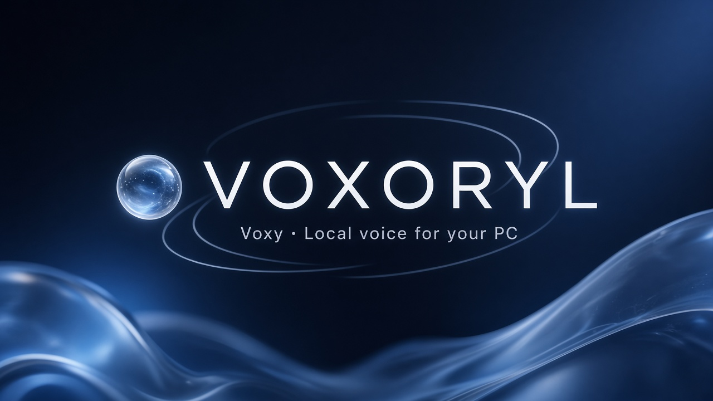
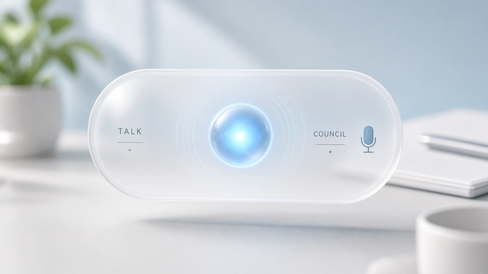

# VOXORYL

<p align="center">
  
</p>

<p align="center">
  <a href="https://github.com/vishalgaur1/VOXORYL/releases/latest"></a>
  <a href="LICENSE"></a>
  <a href="pyproject.toml"></a>
  <a href="https://github.com/vishalgaur1/VOXORYL/releases"></a>
  <a href="https://github.com/vishalgaur1/VOXORYL/pkgs/container/voxoryl"></a>
</p>

<p align="center"><strong>A voice assistant that runs on your PC</strong> — you talk, it opens apps, controls Chrome/YouTube, and helps with your computer. Mostly offline. Say <strong>“Hey Voxy”</strong>.</p>

<p align="center">
  <a href="https://github.com/vishalgaur1/VOXORYL/releases"><strong>Download Releases (Win / Mac)</strong></a>
  ·
  <a href="https://vishalgaur1.github.io/VOXORYL/">Site</a>
  ·
  <a href="docs/PACKAGES.md">Docker package</a>
  ·
  <em>vox-OR-ill</em>
</p>

---

## Demo

<p align="center">
  
</p>

Talk to the floating orb · open Chrome / YouTube · optional screen click/type when you enable it · Doctor & Safe Mode when things go sideways.

| | |
|---|---|
| **Pronunciation** | *vox-OR-ill* |
| **Short name** | **Voxy** |
| **Repo** | https://github.com/vishalgaur1/VOXORYL |

Open-source **local voice assistant** / **PC AI companion** for **desktop voice control** on **Windows** and **Mac** — not a cloud chatbot with optional plugins.

## Find this project

Search engines often miss brand-new repos or autocorrect **VOXORYL**. Use the exact URL:

**https://github.com/vishalgaur1/VOXORYL**

Also search: `Voxy` · `VOXORYL` · `vishalgaur1` · `local voice assistant Windows` · `open source voice assistant Mac` — more tips in [docs/FIND.md](docs/FIND.md).

## What it does (plain English)

- **Talk to your computer** with a voice orb on the desktop
- **Open apps** (Chrome, Notepad, VS Code/Cursor, Spotify, and more)
- **Control Chrome & YouTube** — new tabs, URLs, play the Nth video
- **Optional screen control** — see the screen and click/type when you turn it on
- **Mostly offline** — local models via [Ollama](https://ollama.com) by default; optional cloud for chat only
- **Private on disk** — knowledge and memory stay in `data/` (never shipped in clones)
- **Doctor / Safe Mode** — health checks; can block risky actions while you diagnose

Depth varies by OS and flags; the product **degrades honestly** instead of pretending.

### Voice companion

- **Wake:** say **“Hey Voxy”** (also “Hey Voxoryl” / “Okay Voxy”).
- **Talk or Council** through the voice widget; ASR (Parakeet primary, Whisper / browser speech fallback) and TTS for replies.
- **L0-R stop/cancel/pause:** realtime commands (`stop`, `cancel`, `pause`, `resume`, `quiet`, `listen`, `sleep`) bypass the LLM.

### Local-first reasoning (+ optional cloud)

- **On-device by default** via [Ollama](https://ollama.com).
- **Cloud toggle** (Groq / Gemini / OpenRouter / NVIDIA, etc.) for general chat — **tools still run on your PC**.
- Sensitive flows stay **local-only** per privacy rules.

### Apps, Chrome & YouTube

- Open apps on Windows; macOS uses best-effort `open -a`.
- Chrome: profile, new tab / URL, tab search.
- YouTube: open, wait until ready, **play the Nth video** via screen grounding.

### Screen observe → click / type

- With **`COMPUTER_USE_ENABLED=true`**: screenshot → observe → click/type at coordinates (DPI-aware on Windows).
- Default **off**. Optional Chrome CDP accelerator.

### Widget UI

- Native **voice orb** (pywebview / WebView2 on Windows; browser `--app` fallback) at `/widget`.
- Command center at `/`, mind map at `/mindmap`.
- **Reels** inbox: understand → gate (promote / quarantine / reject) before knowledge vault.

### Instagram (optional)

Receive Reels you share without logging into Instagram. To **post as VOXORYL**, use a Professional IG account + Meta Graph tokens in `.env` (never commit). See product notes below for the full checklist.

### Windows vs macOS

| Area | Windows | macOS |
|---|---|---|
| API, voice widget, memory, Doctor | Yes | Yes |
| Native orb | Yes (WebView2) | Yes when pywebview works; else browser |
| Win32 / UIA computer-use & PowerToys | Yes when enabled | Not supported — limited / best-effort |
| Chrome / YouTube coords | Strongest path | Best-effort open; CU limited |

## Quick start

**Requirements:** Python **3.11+**, optional [Ollama](https://ollama.com/download).

```bash
git clone https://github.com/vishalgaur1/VOXORYL.git
cd VOXORYL

python -m venv .venv

# Windows (PowerShell)
.\.venv\Scripts\Activate.ps1
# macOS / Linux
# source .venv/bin/activate

pip install -r requirements.txt
cp .env.example .env
```

```bash
python scripts/launch_voxoryl.py --console
# Windows silent orb: wscript .\scripts\launch-voxoryl.vbs
# macOS: chmod +x scripts/launch_voxoryl.sh && ./scripts/launch_voxoryl.sh
```

- Command center: http://127.0.0.1:3847  
- Voice widget: http://127.0.0.1:3847/widget  
- Mind map: http://127.0.0.1:3847/mindmap  

## Download a Release (no git required)

Grab a zip from **[GitHub Releases](https://github.com/vishalgaur1/VOXORYL/releases)** — this is where **Windows / Mac** downloadables live.

| Asset | Use |
|---|---|
| `VOXORYL-*-windows.zip` | Windows |
| `VOXORYL-*-macos.zip` | macOS |
| `VOXORYL-*-linux.zip` | Linux |
| `VOXORYL-*-source.zip` | Canonical cross-platform source |

Today these are **portable Python source packages** (+ launch scripts), not frozen EXE/.app yet. Same tree; platform names make the right download obvious.

Push a `v*` tag → [`.github/workflows/release.yml`](.github/workflows/release.yml) builds and attaches assets.

### Install from the zip

1. Download the zip for your OS from the latest [Release](https://github.com/vishalgaur1/VOXORYL/releases).
2. Unzip; install [Python 3.11+](https://www.python.org/downloads/).
3. `python -m venv .venv` → activate → `pip install -r requirements.txt` → copy `.env.example` → `.env`.
4. `python scripts/launch_voxoryl.py --console`

Secrets and `data/` are **never** in Release zips.

## Packages (Docker / GHCR)

The sidebar **Packages** entry is the container registry — **not** the Win/Mac zips.

```bash
docker pull ghcr.io/vishalgaur1/voxoryl:latest
docker run --rm -p 3847:3847 ghcr.io/vishalgaur1/voxoryl:latest
```

Details: [docs/PACKAGES.md](docs/PACKAGES.md) · Image: [ghcr.io/vishalgaur1/voxoryl](https://github.com/vishalgaur1/VOXORYL/pkgs/container/voxoryl)

## Configure (`.env`)

Copy `.env.example` → `.env`. Never commit `.env`.

| Variable | Purpose |
|---|---|
| `GROQ_API_KEY` / `GEMINI_API_KEY` / … | Optional cloud chat |
| `VOXORYL_OWNER_NAME` / `VOXORYL_OWNER_EMAIL` | Optional Chrome profile matching |
| `COMPUTER_USE_ENABLED` | Screen click/type (default `false`) |
| `INSTAGRAM_ACCESS_TOKEN`, `INSTAGRAM_BUSINESS_ACCOUNT_ID` | Optional — post Reels *as* VOXORYL |

See [`.env.example`](.env.example) for the full list.

## Privacy

- Everything under `data/` is **gitignored**.
- Clones get `setup/` templates only.
- Read [`SECURITY.md`](SECURITY.md): never commit `.env`; **rotate keys** if exposed.

## Platform notes

| Feature | Windows | macOS |
|---|---|---|
| API + voice widget | Yes | Yes |
| Native pywebview orb | Yes (WebView2) | Best-effort / browser fallback |
| Win32 / UIA computer-use | Yes when enabled | Not supported |
| Autostart | `scripts/*.ps1` | Login Items / launchd yourself |

## Repository layout

```
voxoryl/           # Python package (API, agents, tools, static UI)
scripts/           # Launchers, probes, packaging
setup/             # Example configs + bootstrap templates
docs/              # Site, assets, packages notes, PRD
tests/             # Smoke tests
.github/workflows/ # Releases + GHCR package publish
Dockerfile         # ghcr.io/vishalgaur1/voxoryl
```

## Windows extras

```powershell
powershell -ExecutionPolicy Bypass -File .\scripts\install-windows.ps1
powershell -ExecutionPolicy Bypass -File .\scripts\install-desktop-shortcut.ps1
powershell -ExecutionPolicy Bypass -File .\scripts\register-autostart-windows.ps1
```

## Name meaning

**VOXORYL** = *Voice Operating eXecutive · On-device Reasoning that Yields Local action*. Day-to-day: **Voxy**.

## Contributing

See [CONTRIBUTING.md](CONTRIBUTING.md) and [CODE_OF_CONDUCT.md](CODE_OF_CONDUCT.md).

## License

Non-commercial use is free under [PolyForm Noncommercial 1.0.0](LICENSE).  
Commercial use requires a paid license — contact **vishalgaur2002@gmail.com**  
(see [`LICENSE`](LICENSE) and [`COMMERCIAL_LICENSE.md`](COMMERCIAL_LICENSE.md)).
