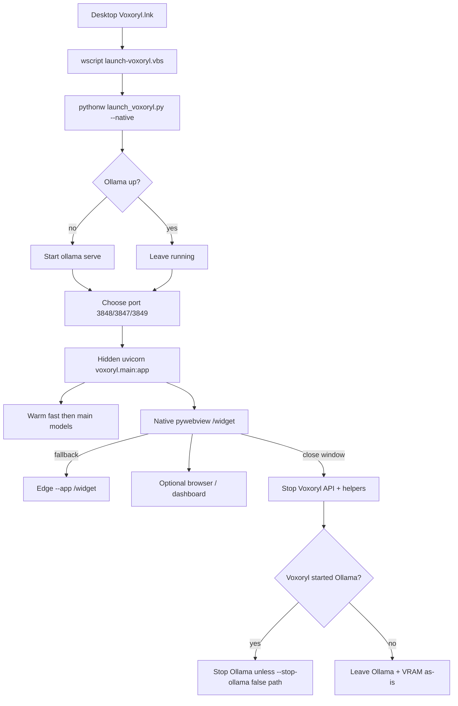
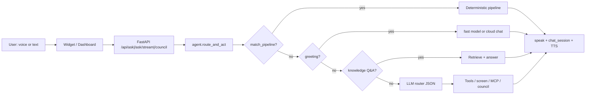
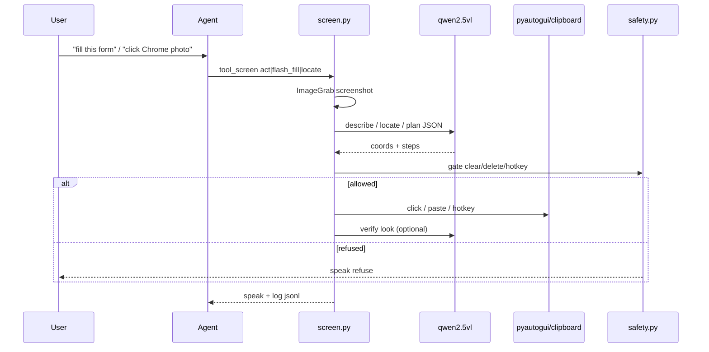
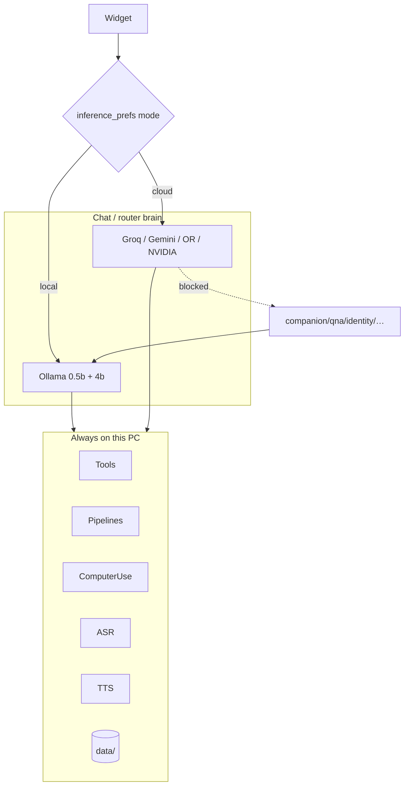

# VOXORYL — Product Requirements Document (PRD)

| Field | Value |
|---|---|
| **Product** | **VOXORYL** (vox-OR-ill) — Voice Operating eXecutive · On-device Reasoning that Yields Local action |
| **Owner / primary user** | Product owner (configure via `.env` / identity) |
| **Document status** | Living source of truth (repo + product history as of 2026-09-11) |
| **Repo root** | Repository clone root (portable; not a fixed drive letter) |
| **Audience** | Product owner, contributors, agents implementing roadmap |
| **Contact (commercial)** | vishalgaur2002@gmail.com |

This PRD describes **what VOXORYL is**, **what already ships**, **how it is built**, **what is broken or weak**, and **what to build next**. Tone is operational, not marketing.

**Document split:** runtime / architecture / capabilities stay here. Downloadable productization (funnel, Hardware Score, degradation matrix, packaging, Doctor, licensing) lives in [`PRD-distribution.md`](PRD-distribution.md). Do not merge installer minutiae into this file.

---

## 1. Vision & product thesis

### 1.1 What we are building

**VOXORYL** is a **local-first, always-on, AGI-style PC companion** for a personal Windows or macOS machine. It is not a chat website with optional tools. It is a **desktop product**: one launcher, silent start where supported, a native voice orb, optional web console, and the ability to **see and control the PC** when enabled (Windows-first computer-use).

Core thesis (from README, `setup/powerups.md`, `setup/IDEAS.md`, and implementation):

1. **Small local models + structure beat raw big chat** on a 6GB VRAM laptop (GTX 1660 Ti class / ~16GB RAM). Deterministic pipelines, software knowledge (keyboard shortcuts), dual-model routing, and optional free cloud brains matter more than upgrading to a 70B local weight.
2. **Privacy by default.** Personal chats, companion/therapy analysis, QnA, identity, wellbeing, spend, food, neuro profiles stay on-disk under `data/` (gitignored). Cloud inference is an explicit mode for *general* agent chat/router only; tools and computer-use still run locally.
3. **Voice + hands.** Talk through the orb; when asked, look at the screen, click, type, fill forms, drive Chrome profiles/tabs, and use PowerToys / Windows ops — without pretending to be OpenAI Astra yet.
4. **Jack of all trades, not a medical product.** Optional accessibility / short-focus modes exist only if asked. Never invent wealth, ADHD diagnosis, or medical care.

### 1.2 Success criteria

| ID | Criterion | How we know |
|---|---|---|
| S1 | Double-click **Voxoryl** on Desktop → Ollama + API + native orb without a console flash | `scripts/launch-voxoryl.vbs` → `launch_voxoryl.py --native` |
| S2 | “Hi” replies in ~sub-second local latency when fast model is warm | `qwen2.5:0.5b` path in `agent.py` |
| S3 | Deep work (research, Chrome, screen act) routes to pipelines / main model / tools without dumping vault noise on greetings | Router + pipeline matchers + knowledge score gate |
| S4 | Chrome “open my profile” lands on the configured owner profile | `--profile-directory` from Local State + vision locate fallback + `VOXORYL_OWNER_*` |
| S5 | Voxoryl never deletes outside the project/workspace tree and never clears text it did not write | `safety.py` fail-closed + tests in `scripts/test_safety.py` |
| S6 | Close the orb → Voxoryl API stops; RAM/CPU freed; Ollama left alone unless Voxoryl started it | Desktop session lifecycle |
| S7 | Local / Cloud toggle works; tools still local; sensitive kinds never upload | `inference.py` + `privacy.py` |
| S8 | Follow-ups (“sure”, “another”) continue the prior thread | `chat_session` rolling summary |

### 1.3 Non-goals

- **Not** a multi-tenant SaaS or hosted AGI cloud product.
- **Not** continuous Astra-class always-see / always-control out of the box today (gap is explicit — see §12).
- **Not** a clinical / medical / diagnostic product.
- **Not** unrestricted filesystem delete / shell shred outside the project tree.
- **Not** shipping personal `data/` to GitHub (clones get templates + setup only).
- **Not** requiring Cursor IDE to use the product day-to-day (Cursor is for building Voxoryl).

### 1.4 Distribution constraints (runtime must honor)

Shipping details are in [`PRD-distribution.md`](PRD-distribution.md). The **runtime** must expose and respect these knobs so a downloadable build can work on any supported PC—not only a single developer machine:

| Knob / behavior | Purpose |
|---|---|
| `PORTABLE_DATA_ROOT` | User data (memory, prefs, DB, logs) independent of install path |
| `HARDWARE_PROFILE` | Explain My PC / Doctor |
| `CAPABILITY_TIER` | Lite / Balanced / Strong / Beast degradation |
| `MODEL_PROFILE` | Applied local model set |
| `PERMISSIONS` | Mic, screen, UIA, network flags |
| `DIAGNOSTICS_EXPORT` | Support bundles without secrets |
| `MIGRATION_VERSION` | SQLite / schema upgrades |
| First-run hardware probe | Funnel into tier recommendation |
| Capability degradation by tier | Same product shell, honest limits |
| Offline core | Local forever without Cloud |
| Model download resume | Interrupted pulls must not brick the app |
| Secure credential path | OS keyring direction for public users |
| Safe Mode + kill switch | Support and trust |
| Wake State `AWARE` / `PAUSED` / `DISABLED` | Perception product UX |

Compatibility contract fields for distributed builds (declared per release): `runtime_version`, `schema_version`, `capability_tier`, `model_profile`, `minimum_ram`, `minimum_vram`, `supported_gpu_backends`, `required_os_features`, `optional_dependencies`.

### 1.5 Agent Runtime (P0 modules)

Frozen harness lives under `voxoryl/` — see `voxoryl/RUNTIME_RULES.md`. Key modules: `supervisor`, `event_bus`, `cancellation`, `realtime_loop`, `state_store`, `l0r`, `capabilities`, `runtime` (TaskEngine), `perception`, `audio_runtime`, `vision_runtime`, `browser_adapter`, `target_resolver`, `context_broker`, `memory_manager`, `inference_backend`, `resource_manager`, `cache_layer`, `events_db`, `provenance`, `doctor`. Benchmarks: `scripts/benchmark_voxoryl.py`. APIs: `/api/runtime`, `/api/doctor`, `/api/realtime/*`.

---

## 2. Personas & use cases

### 2.1 Primary persona — Owner (operator)

- Runs Windows 10/11 or macOS on a mid-tier laptop (documented target class: ~6GB VRAM, 16GB RAM).
- Wants a butler-like neural voice companion that feels productized (one icon / one script).
- Switches between **privacy mode** (Local Ollama) and **speed mode** (Cloud Groq/etc.) for chat.
- Uses Chrome with **multiple profiles** (configure via `VOXORYL_OWNER_*` and optional `data/software_knowledge/chrome.json`).
- Builds software; wants Voxoryl to research, remember, organize, and eventually control the desktop like a co-pilot.

Secondary “product surfaces” (same human, different entry points):

| Surface | Persona moment | Primary path |
|---|---|---|
| Voice orb | Hands-busy / ambient companion | `/widget` in pywebview |
| Web console | Typed deep work, memory panels, Council | `/` dashboard |
| Mind map | Explore knowledge graph | `/mindmap` |
| Daemon | Always-on nudges (market, wellbeing, screen watch) | APScheduler in API process |

### 2.2 Use cases

| UC | Name | Flow | Mode |
|---|---|---|---|
| UC1 | Greeting / small talk | “Hi” / “thanks” → fast 0.5b (or cloud) → short TTS | Talk |
| UC2 | Deep work ask | Tools / pipelines / router → main 4b or cloud → optional Council | Tools / Council |
| UC3 | Chrome control | Open Chrome → resolve profile directory or click picker → new tab / goto tab / URL | Computer use + software knowledge |
| UC4 | Form fill | Flash-fill from saved identity → paste full fields (never char-by-char) | Screen `flash_fill` |
| UC5 | Screen look | Screenshot → VL describe → speak summary | Screen watch / look |
| UC6 | Screen act | Multi-round screenshot → plan JSON → pyautogui → verify | Computer use |
| UC7 | Research / market | DuckDuckGo (+ optional SearXNG) → knowledge / briefs | Pipelines |
| UC8 | Memory recall | Knowledge retrieve / memory panel / “remember that…” | Local only |
| UC9 | Local privacy session | Companion, QnA, chat export — Ollama only | Privacy hard rule |
| UC10 | Cloud speed session | Toggle Cloud → Groq stream for chat; tools still on PC | Inference prefs |
| UC11 | Desktop lifecycle | Start silent → work → close widget → stop API | Product launch |
| UC12 | PowerToys / Windows | Brightness, volume, launcher, FancyZones, etc. | `windows_ops` / bridge |

---

## 3. Current feature inventory

Everything below **exists in the repo today** (modules and/or APIs). Depth varies; §9 marks reliability.

### 3.1 Product shell

- **Desktop shortcut** `Voxoryl.lnk` → `wscript` → `scripts/launch-voxoryl.vbs` (silent).
- **Launcher** `scripts/launch_voxoryl.py` (+ root `launch_voxoryl.py` alias): ensure Ollama, pick port, start hidden API, open native widget.
- **Native widget**: pywebview + Edge WebView2, window title **VOXORYL**.
- **Fallback widget**: Edge/Chrome `--app=http://127.0.0.1:<port>/widget`.
- **Web dashboard** `/` redesigned console (Direct / Tools / Council).
- **Boot overlay** on widget while API/models warm.
- **Reload widget (dev)** hard-reloads UI without full process restart.
- **Pin / always-on-top** hints via launcher Windows helpers.
- **Autostart** script: `scripts/register-autostart-windows.ps1`.
- **Install**: `scripts/install-windows.ps1`, desktop shortcut installer, icon generator.

### 3.2 Voice I/O

- **Orb UI** (`widget.html` / `widget.js` / `orb.js`): Talk vs Council, Start/Stop, echo suppression, post-TTS mic cooldown.
- **ASR**: Parakeet TDT 0.6B v3 via `onnx-asr` (primary); Whisper fallback (Hindi / missing Parakeet).
- **Browser speech** fallback when accurate mic unavailable.
- **TTS**: `edge-tts` (default `en-US-AndrewMultilingualNeural`; locale packs can override).
- **Mic / speaker device pickers** in Settings (persisted in `localStorage`).
- **i18n voice packs**: EN / HI / ES / FR / DE.

### 3.3 Inference brains

- **Local dual models**: fast `qwen2.5:0.5b` (greetings) + main `qwen3.5:4b` (work).
- **Vision**: `qwen2.5vl:3b` (pull if VRAM ≥ 4GB).
- **Embeddings**: `nomic-embed-text`.
- **Hardware advisor**: `voxoryl/models_setup.py` + `setup/models.json` tiers (lite → beast).
- **Cloud providers**: Groq (primary), Gemini, OpenRouter free, NVIDIA NIM — OpenAI-compatible streaming.
- **Widget Local / Cloud toggle** → `data/inference_prefs.json` (no secrets in prefs).
- **Streaming ask**: `POST /api/ask/stream` for snappy cloud / greeting replies.

### 3.4 Agent core

- **Intent router** (`agent.py`): JSON plan → tools / answer / council.
- **Deterministic pipelines** (`pipelines.py`): ~40 named workflows (LocalClaw pattern).
- **Continuation logic**: “yes / sure / another” continues prior pipeline/thread.
- **Greeting gate**: no vault dump on hi/thanks.
- **Knowledge Q&A fast path** when retrieve score is high.
- **Council**: Strategist / Critic / Builder / Scout (+ optional online advisor).
- **Schema-lock router parse** (`schema_lock.py`).
- **Verifier** for plans (`verifier.py`).
- **Style / speak system** (`style.py`) — finalize spoken replies.
- **Code-act** sandboxed Python in workspace.
- **MCP bridge** (config-driven; servers mostly disabled by default).

### 3.5 Memory & knowledge

- **`memory.json`**: profile, facts, tags.
- **`skills.json`**: persistent skill prompts.
- **`knowledge.md`**: topic-headed dated facts + retrieve + auto log.
- **Knowledge graph + mind map**: `knowledge_graph.json` → `/mindmap`.
- **Chat session**: rolling summary in `chat_session.json` (ChatGPT-style).
- **Cold memory**: settled facts that must not volunteer unless triggered.
- **Embeddings cache** for semantic retrieve.
- **Dashboard Memory / Skills / Knowledge panels**.

### 3.6 Computer use & Chrome

- **Screen capture** (Pillow ImageGrab) → `data/screenshots/`.
- **VL describe / plan / locate** via Ollama vision model.
- **Mouse/keyboard** via pyautogui + clipboard paste.
- **Actions**: look, act, locate, type, paste, flash_fill, watch.
- **Screen watch daemon**: light periodic context (default 45s); faster while controlling.
- **Chrome control**: profile open (`--profile-directory`), tab search, new tab URL, site recipes.
- **Software knowledge** store under `data/software_knowledge/` (seeded Chrome/Windows shortcuts; learns successes).
- **Identity flash-fill** from memory/knowledge.
- **Owned-write safety** ledger.

### 3.7 Windows / PowerToys

- Open apps (Chrome, Edge, Cursor, VS Code, Spotify, WhatsApp, etc.) including Hindi phrases.
- Brightness / volume / mute (WMI / nircmd / SendKeys — degrade with hints).
- PowerToys bridge: launcher, Awake, FancyZones, Color Picker, Text Extractor, Mouse Jump, Always On Top.

### 3.8 Connectors & life ops (optional env)

| Area | Module / tool | Notes |
|---|---|---|
| Research / market | `research.py`, `tools.tool_research`, market scan | DuckDuckGo; optional SearXNG |
| Notes / Obsidian | `tool_notes` | Local inbox + vault sync |
| GitHub | `tool_github` | List / README / file |
| Email IMAP | `tool_email` | Read-only triage |
| Marketing copy | `tool_marketing` | Saves under `data/marketing` |
| Video / ComfyUI | `tool_video`, `media_gen` | Script + Comfy probe |
| Leads / SMTP | `leads.py`, approvals | Send only after approve |
| Sites / Vercel | `sites.py` | Deploy after approve |
| Bookings | `bookings.py` | Genuine-site allowlist |
| Docs vault | `docs_vault.py` | Local legal/docs |
| Food / health / spend | respective modules | Habit coaching, not medical |
| Wellbeing / todos / planner | daemon + APIs | Deadlines required for todos |
| Books / music / curiosity | vaults + nudges | Mild, non-spammy |
| Style colors | photo → palette → shops | Asks value_mode |
| Android lab | emulator smoke | Plumbing |
| Hyper-V sandbox | disposable VM | Plumbing |
| Camera | webcam → VL | Needs OpenCV |
| Net profile | proxy/VPN ask+reset | |
| Self-upgrade | gap log → Cursor prompts | |
| Sale watch | Amazon/OLX watches | Interval tick |
| Melody | hum→MIDI / lyrics find | |
| Ingest / WhatsApp | share inbox | |
| Multitask | parallel intents | |

### 3.9 Safety, privacy, bootstrap

- Fail-closed safety policy (§13).
- `setup/privacy.json` + `privacy.py` sensitive-kind blocks.
- Bootstrap from `setup/voxoryl.setup.json` + templates; never overwrite personal files.
- Approvals gate for outbound / deploy actions.

### 3.10 Daemon jobs (API process)

| Job | Schedule | Purpose |
|---|---|---|
| Daily autonomy | 09:00 | Market scan + council brief → notes |
| Neuro improve | 08:15 | Optional reply-style research |
| Curiosity | 10:30 | One tasteful nudge |
| Wellbeing | 11:00 & 18:30 | Check-in prompts (quota) |
| Sale watch | every 3h | Price checks |
| Heartbeat | hourly | Memory heartbeat fact |
| Screen watch | ~45s | Light screen context |
| Screen watch active | 12s | While controlling |

---

## 4. Architecture

### 4.1 Desktop session (product path)



### 4.2 Agent / tools / pipelines



### 4.3 Voice data flow

```mermaid
sequenceDiagram
  participant Mic
  participant Widget
  participant API
  participant ASR as Parakeet/Whisper
  participant Agent
  participant LLM as Ollama/Cloud
  participant TTS as edge-tts
  Mic->>Widget: audio / WebSpeech
  Widget->>API: POST /api/transcribe (optional)
  API->>ASR: wav → text
  ASR-->>Widget: transcript
  Widget->>API: POST /api/ask/stream
  API->>Agent: route_and_act
  Agent->>LLM: fast/main/cloud
  LLM-->>Agent: speak + tools
  Agent-->>Widget: SSE / JSON
  Widget->>API: POST /api/speak
  API->>TTS: neural audio
  TTS-->>Widget: play; mic muted during speak
```

### 4.4 Computer-use data flow



### 4.5 Inference mode split



---

## 5. Tech stack

| Layer | Choice |
|---|---|
| Language | Python 3.11+ |
| API | FastAPI + Uvicorn |
| Settings | pydantic-settings + `.env` |
| Scheduler | APScheduler |
| Local LLM runtime | Ollama (`http://127.0.0.1:11434`) |
| Main chat model | `qwen3.5:4b` (`VOXORYL_MAIN_MODEL` / `OLLAMA_MODEL`) |
| Fast chat model | `qwen2.5:0.5b` |
| Vision | `qwen2.5vl:3b` (tiered upgrades in `models.json`) |
| Embeddings | `nomic-embed-text` |
| ASR | `onnx-asr` → `nemo-parakeet-tdt-0.6b-v3`; Whisper fallback |
| TTS | `edge-tts` |
| Desktop UI host | `pywebview` ≥5 (WinForms + WebView2 / edgechromium) |
| Widget / dashboard | Static HTML/CSS/JS under `voxoryl/static/` |
| Screen control | Pillow ImageGrab, pyautogui, pyperclip |
| Search | duckduckgo-search; optional SearXNG |
| HTTP client | httpx |
| Cloud LLMs | Groq, Gemini OpenAI-compat, OpenRouter, NVIDIA NIM |
| Windows | ctypes / WMI / registry / PowerToys exes / Chrome Local State |
| MCP | Config in `setup/mcp.servers.json` (stdio/http; mostly disabled) |
| Venv | `D:\VOXORYL\.venv` |
| Default ports | **3847** (config); launcher prefers **3848** if 3847 busy (Cursor), then 3849 |
| Optional media | ComfyUI (`COMFYUI_URL`), OpenCV camera, Android SDK, Hyper-V |

### 5.1 Ollama model catalog (from `setup/models.json`)

| Role | Default pull | Notes |
|---|---|---|
| Chat (main) | `qwen3.5:4b` | Daily brain |
| Fast | `qwen2.5:0.5b` | Greetings / chitchat |
| Embed | `nomic-embed-text` | Always |
| Vision | `qwen2.5vl:3b` | If VRAM ≥ 4GB |
| Lite tier | `qwen2.5:1.5b` | Weak GPU |
| Strong tier | `qwen3.5:9b` + `qwen2.5vl:7b` | 8–12GB VRAM |
| Beast tier | `qwen2.5:32b` etc. | 16GB+ VRAM |

---

## 6. How we built it / implementation notes (file map)

### 6.1 Entry & lifecycle

| Path | Responsibility |
|---|---|
| `launch_voxoryl.py` | Thin alias → `scripts/launch_voxoryl.py` |
| `scripts/launch_voxoryl.py` | Product launcher: Ollama, port, server, pywebview, shortcut, stop |
| `scripts/launch-voxoryl.vbs` | Silent Desktop entry (no console) |
| `run.py` | Developer uvicorn console |
| `voxoryl/lifecycle.py` | Ports, session.json, Ollama start/stop policy, browser helpers |
| `voxoryl/daemon.py` | Cron/interval autonomy + screen watch |
| `voxoryl/bootstrap.py` | First-run private `data/` from setup templates |
| `voxoryl/models_setup.py` | Probe hardware, recommend/apply/pull/warm models |
| `voxoryl/main.py` | FastAPI app: all HTTP routes, static mounts, shutdown |

### 6.2 Brain & routing

| Path | Responsibility |
|---|---|
| `voxoryl/agent.py` | `route_and_act`, greeting/continuation, knowledge path, tool dispatch |
| `voxoryl/pipelines.py` | Keyword → deterministic workflows |
| `voxoryl/llm.py` | Ollama chat + tier (fast/main) + keep_alive |
| `voxoryl/inference.py` | Local/Cloud mode, providers, streaming cloud chat |
| `voxoryl/inference_prefs.py` | Prefs helpers (paired with inference) |
| `voxoryl/council.py` | Multi-voice deliberation + synthesis |
| `voxoryl/schema_lock.py` | Constrained router JSON parse |
| `voxoryl/verifier.py` | Plan verification |
| `voxoryl/planner.py` | Day/week/trip/… plans |
| `voxoryl/multitask.py` | Parallel intent runner |
| `voxoryl/privacy.py` | Sensitive-kind cloud blocks |
| `voxoryl/style.py` | Speak system prompts / finalize |

### 6.3 Perception & control

| Path | Responsibility |
|---|---|
| `voxoryl/screen.py` | Screenshot, VL, act loop, locate_and_click, flash_fill, watch |
| `voxoryl/chrome_control.py` | Profile launch, picker vision, tabs, URLs |
| `voxoryl/software_knowledge.py` | Per-app shortcuts, recipes, Chrome Local State mapping, learn |
| `voxoryl/powertoys_bridge.py` | Launch/hotkey PowerToys utilities |
| `voxoryl/windows_ops.py` | Open apps, brightness/volume, Hindi open phrases |
| `voxoryl/safety.py` | Owned writes, delete sandbox, shell gate |
| `voxoryl/camera.py` | Webcam → VL |
| `voxoryl/transcribe.py` | Parakeet / Whisper ASR |
| `voxoryl/identity.py` | Form field map for flash-fill |

### 6.4 Memory & knowledge

| Path | Responsibility |
|---|---|
| `voxoryl/memory.py` | memory.json + skills |
| `voxoryl/knowledge.py` | knowledge.md retrieve/log |
| `voxoryl/mindmap.py` | Graph + HTML mind map |
| `voxoryl/embeddings.py` | Ollama embeddings + cache |
| `voxoryl/chat_session.py` | Rolling multi-turn session |
| `voxoryl/cold_memory.py` | Non-volunteering settled facts |
| `voxoryl/ingest.py` | Share / WhatsApp ingest |

### 6.5 Domain tools (selected)

`tools.py` (research, market, notes, github, email, computer, marketing, video), plus dedicated modules: `research`, `books`, `music_taste`, `curiosity`, `todos`, `wellbeing`, `spend`, `food_memory`, `health`, `neuro`, `bookings`, `docs_vault`, `sites`, `leads`, `approvals`, `qna`, `companion`, `media_gen`, `melody`, `sale_watch`, `self_upgrade`, `net_profile`, `android_lab`, `sandbox_hv`, `code_act`, `mcp_bridge`, `i18n_voice`, `prefs`, `hardware`, `config`.

### 6.6 UI

| Path | Responsibility |
|---|---|
| `voxoryl/static/widget.html` | Voice product UI |
| `voxoryl/static/widget.js` / `widget.css` / `orb.js` | Orb behavior, inference toggle, devices, reload |
| `voxoryl/static/index.html` / `app.js` / `styles.css` | Web command center |
| `voxoryl/static/voxoryl.ico` | Desktop icon |

### 6.7 Setup & scripts

`setup/*` — models, privacy, MCP example, curiosity sites, genuine sites, food compounds, neuro baseline, Comfy workflow, templates, IDEAS, powerups, VENDOR_NOTES.  
`scripts/*` — install, start, smoke Chrome profile, probe, safety test, icon, autostart.

---

## 7. Tools, skills, connectors, external software & repos

### 7.1 Agent-callable tool names (router)

From `ROUTER_SYSTEM` in `agent.py`:

`research`, `market_scan`, `notes`, `remember`, `knowledge`, `github`, `email`, `computer`, `screen`, `marketing`, `video`, `mcp`, `code_act`, `ingest`, `whatsapp`, `melody`, `media`, `leads`, `approvals`, `sites`, `qna`, `companion`, `bookings`, `docs`, `prefs`, `food`, `health`, `spend`, `wellbeing`, `todos`, `neuro`, `android`, `sandbox`, `camera`, `music`, `books`, `style_colors`, `curiosity`, `windows`, `net_profile`, `self_upgrade`, `multitask`, `planner`, `sale_watch`, `i18n`.

Pipelines additionally expose fast paths for: `powertoys`, `chrome`, `flash_fill`, `screen_*`, `save_reel`, etc.

### 7.2 MCP

Declared in `setup/mcp.servers.json` (all **disabled** by default):

| Server | Transport | Intent |
|---|---|---|
| filesystem | stdio `@modelcontextprotocol/server-filesystem` | Sandbox `workspace_sandbox` |
| git | stdio `@modelcontextprotocol/server-git` | Repo status/log/diff |
| browser | stdio puppeteer MCP | Navigate/click/fill |
| custom-http | http `127.0.0.1:3920` | Local tool bridge |

Bridge: `voxoryl/mcp_bridge.py` — list/call; delete-like MCP tools gated by safety.

### 7.3 External software on the host

- **Ollama** (required for Local).
- **Google Chrome** (profiles + computer use recipes).
- **Microsoft Edge / WebView2** (widget host).
- **PowerToys** (optional, recommended).
- **Obsidian** (optional vault path).
- **ComfyUI** (optional local image/video).
- **Android SDK / Hyper-V** (optional labs).
- **nircmd** (optional volume/brightness helper).
- **Node/npx** (optional MCP stdio servers).

### 7.4 Cloud / SaaS connectors (keys in `.env` only)

Groq, Gemini AI Studio, OpenRouter, NVIDIA NIM, GitHub API, IMAP email, SMTP (approved sends), Vercel (approved deploys), optional SearXNG.

### 7.5 Design inspiration / referenced repos

Documented in `setup/powerups.md`: LocalClaw (pipelines), smolagents (code-act), grammar-based-agents, Outlines/XGrammar, SLM-MUX, Heartwood/MindForge-style knowledge graphs, Hex-style Parakeet ASR. Cursor is the **build** environment; self-upgrade module writes prompts for Cursor — not a runtime dependency for the Desktop product.

### 7.6 Git remotes

At documentation time the local git branch may have **no commits / remotes yet**. Product intent (README) is GitHub-safe clones with private `data/` gitignored. Do not treat remotes as required for daily use.

---

## 8. Runtime behavior

### 8.1 Start

1. Desktop icon / VBS / `launch_voxoryl.py --native`.
2. Ensure dirs: `data/logs`, `data/runtime`.
3. Ensure Ollama reachable (start if needed; record `started_by_us`).
4. Choose free port from `(3848, 3847, 3849)`.
5. Spawn uvicorn with `VOXORYL_DESKTOP_SESSION=1`, logs to `data/logs/server.log`.
6. Bootstrap private data if first run; check/pull models as configured.
7. Open pywebview to `/widget` (boot overlay covers warm-up).
8. Optionally open dashboard if `--dashboard` / `VOXORYL_OPEN_DASHBOARD=1`.
9. Write `data/runtime/session.json` (pids, port, ollama ownership).

### 8.2 While running

- API serves widget, dashboard, mindmap, all `/api/*`.
- Daemon jobs run inside the API process.
- Ollama may keep models loaded (`keep_alive` often `30m` chat / `10m` vision).
- Screen watch refreshes light context when computer use enabled.
- Widget polls `/api/status`; on connection failure shows Retry / Reload guidance.

### 8.3 Stop

- Closing the **native widget** stops the Voxoryl API and Voxoryl-owned helpers.
- Ollama stops **only if** this launcher started it (unless forced with `--stop-ollama` policy flags).
- Manual: `launch_voxoryl.py --stop`.
- Models may remain in Ollama VRAM until Ollama idle-unload or process exit — this is intentional to keep next “hi” fast.

### 8.4 Tools vs Talk vs Council

| Mode | Behavior |
|---|---|
| Talk (widget) | Voice + `route_and_act` (pipelines/tools allowed unless pure greeting) |
| Council (widget/dashboard) | `force_council` multi-voice path |
| Direct (dashboard) | Lighter path / less tool pressure (UI mode) |
| Tools (dashboard default) | Full tool-capable asks |

### 8.5 In-memory vs on-disk

| State | Location |
|---|---|
| Chat turns + summary | `data/chat_session.json` |
| Inference mode | `data/inference_prefs.json` + env |
| Screen watch latest | process memory + `data/screen_watch.json` |
| Owned writes | `data/safety/owned_writes.json` |
| Session pids/port | `data/runtime/session.json` |
| Model weights | Ollama’s store; VRAM via Ollama process |

---

## 9. What works vs what doesn’t / challenges

Blunt assessment from code + product history themes (Chrome profile, computer use, dual models, native widget, safety, Local/Cloud).

### 9.1 Works well enough for daily use

- Silent Desktop launch path and single `Voxoryl.lnk` hygiene (purge duplicate shortcuts).
- Fast greeting path when `0.5b` is installed and warm (~0.1s class responses reported in product goals).
- Pipeline keyword routing (Chrome, windows, books, research, etc.) — more reliable than freeform 4B tool JSON alone.
- Chrome **`--profile-directory`** resolution via Local State emails / photo heuristics — major fix vs inventing click coordinates.
- `locate_and_click` with verify-gone for profile picker dismissal.
- Owned-write / project-tree delete safety model.
- Local vs Cloud toggle with tools remaining local; sensitive kinds forced local.
- Chat session rolling summary for short follow-ups.
- Parakeet ASR path when `onnx-asr` installed; edge-tts neural voice.
- Hardware model advisor + pull-on-clone defaults.

### 9.2 Fragile / incomplete

| Issue | Reality |
|---|---|
| **Computer-use reliability** | Still screenshot→plan→click loops with step caps; VL 3B mis-localizes; not continuous control |
| **Invented click coords** | Historically bad when model guessed without locate; mitigated by Profile directory + locate JSON, not eliminated for arbitrary UI |
| **Chrome profile picker** | Photo vs orange-V still needs careful prompts; vision fallback is slower and error-prone |
| **4B greetings** | Slow/multi-second if traffic wrongly hits main model or models cold-swap in VRAM |
| **VRAM swap** | Fast + main + vision + embed contend on 6GB; thrashing kills latency |
| **Edge `--app` widget** | Cache/stale UI; product moved to pywebview; `--browser-widget` remains escape hatch |
| **Widget-as-webview history** | Early product used browser app windows; overlap / focus bugs with always-on-top and multi-monitor |
| **Connection refused** | Widget shows errors when API down or wrong port; Reload helps UI not a dead server |
| **MCP** | Config present; servers off; not a polished connector surface yet |
| **Android / Hyper-V labs** | Plumbing “tech ready,” not daily-driver polished |
| **Council on 4B** | Four sequential local voices = slow; better for hard tasks only |
| **Cloud key exposure** | Keys live in `.env` (correct); never commit; prefs must not store secrets (enforced by design) |
| **Astra gap** | No continuous frame stream, no grounded OS accessibility tree as primary, limited verify-after-act |
| **Knowledge over-sharing** | Mitigated by score gates + cold memory, but retrieval still imperfect |
| **Git empty / no remote** | Versioning/product sync may not be set up yet |

### 9.3 Explicit product history fixes (keep)

1. Prefer **Chrome profile directory** over vision for “open my profile”.
2. Prefer **paste full strings** over character typing.
3. Prefer **shortcuts / software_knowledge** over mouse hunting.
4. Dual model: **never** use 4B for bare “hi” when Local.
5. Native **pywebview** default; Edge app is fallback.
6. Safety **fail closed** on unclear ownership.

---

## 10. Performance

### 10.1 Expected / targeted latency

| Path | Expected | Notes |
|---|---|---|
| Local greeting (`0.5b`, warm) | ~0.1–0.5s to first tokens | Goal; cold start higher |
| Local main (`4b`) | multi-second | Planning / tools / knowledge rewrite |
| Cloud Groq stream | often sub-second TTFT | Free-tier RPM/RPD limits |
| ASR Parakeet | hundreds of ms–few s | Depends on utterance length / device |
| TTS edge-tts | network + synth | Can dominate short replies |
| Screen look (VL 3b) | several–tens of seconds | Image encode + VL |
| Screen act round | look + plan + actions × N | `COMPUTER_USE_MAX_STEPS` default 12; multi-round |
| Council ×4 local | very slow | Use sparingly |

### 10.2 Bottlenecks

1. **VRAM residency** — swapping 0.5b ↔ 4b ↔ VL.
2. **Vision round-trips** — every act step may re-screenshot + re-ask VL.
3. **ASR + TTS serial** with mic mute cooldown (~1.4s post-speak).
4. **Router LLM call** when pipelines don’t match.
5. **DuckDuckGo / network** on research pipelines.
6. **Step limits** truncate long UI tasks.
7. **Free cloud rate limits** (Groq ~30 RPM class; model RPD caps).

### 10.3 How to make it faster (current levers)

- Keep **fast model** warm (`keep_alive`, launcher warm order: fast then main).
- Prefer **pipelines** and **software_knowledge** / PowerToys hotkeys over vision.
- Use **Cloud** for chat when privacy allows.
- Reduce vision steps: locate once, batch form pastes, Chrome flags/`--profile-directory`.
- Avoid Council for trivial asks.
- Hardware tier apply (`models_setup --apply`) if wrong size models installed.
- Optional future: llama.cpp speculative decode, smaller VL, accessibility APIs (roadmap).

---

## 11. Memory improvements

### 11.1 What exists

| Mechanism | Behavior | Limits |
|---|---|---|
| `chat_session` | Recent turns + rolling summary (~7k char budget, summary ≤2k) | Tuned for ~8k ctx 4B |
| `memory.json` | Profile + tagged facts | Manual / tool remember |
| `knowledge.md` | Topic sections + retrieve | Score threshold; can miss or over-match |
| Knowledge graph / mindmap | Topic links | Needs maintenance quality |
| Embeddings cache | Semantic retrieve | Depends on embed model loaded |
| Cold memory | Don’t volunteer settled facts | Must set triggers well |
| Dashboard Memory UI | Read/inspect | Not a full editor UX |
| Skills | Prompt additives | Easy to accumulate noise |

### 11.2 What’s weak

- No true **episodic** timeline (“what we did Tuesday on Chrome”).
- Summary compaction is LLM-assisted but lossy; long projects drift.
- Software knowledge learning is shallow vs full app skill graphs.
- Identity for forms is heuristic (regex / headings), not a verified vault UI.
- Cross-session “user facts RAG” is split across memory/knowledge/cold without one query planner.

### 11.3 Memory roadmap

| Priority | Item |
|---|---|
| P0 | Longer / smarter chat summary; surface summary in UI; clear/export controls |
| P0 | Unify retrieve: chat summary + memory + knowledge + cold + software_knowledge snippets |
| P1 | Episodic event log (tool outcomes, Chrome sites, form fills) with decay |
| P1 | RAG over `software_knowledge` + user facts for computer-use planning |
| P2 | Vector DB optional; per-project memory scopes; conflict resolution UI |

---

## 12. Computer use / “Astra-like” vision

### 12.1 Current loop

1. Gate: `COMPUTER_USE_ENABLED` (default false).
2. Capture primary monitor screenshot (downscale ≤1280px wide).
3. VL describes or returns locate `{x,y}` or multi-step plan JSON.
4. Execute via pyautogui / clipboard; safety gates on clear/delete.
5. Optional verify (e.g. picker text gone); multi-round until done or limits.
6. Parallel: screen watch every ~45s injects light context into chat prompts.
7. Chrome prefers OS launch flags + keyboard recipes before vision.

### 12.2 Desired (Astra-class / continuous)

- **Always-see**: continuous or high-FPS frame stream (or event-driven accessibility + sparse frames).
- **Always-control**: low-latency mouse/keyboard with grounded targets (DOM/AX tree / UI Automation), not guessed pixels when avoidable.
- **Verify-after-act** as default, not optional.
- **App-specific skills** that encode reliable recipes (Chrome, Cursor, Explorer) before general VL.
- **Owner narration**: short spoken status without blocking control loop.
- Competitive bar: frontier computer-use agents (OpenAI computer-using agents / Astra-like demos) that maintain persistent visual state and recover from failed clicks.

### 12.3 Gap analysis

| Capability | Voxoryl today | Frontier CU | Gap |
|---|---|---|---|
| Persistent vision | Periodic watch + on-demand shots | Continuous / streaming | Large |
| Grounding | Pixel coords from 3B VL | DOM/AX + vision fusion | Large |
| Recovery | Limited re-look rounds | Explicit replan + memory of failures | Medium |
| App skills | Chrome/Windows seeds | Rich skill libraries | Medium |
| Latency | Seconds per round | Sub-second loops | Large |
| Safety | Strong local ownership rules | Product-specific | Voxoryl ahead on delete/text ownership |
| Offline | Fully local VL path | Often cloud CU | Voxoryl privacy advantage |

### 12.4 Requirements for next-gen CU (product)

1. Continuous frame buffer (configurable FPS) with privacy kill-switch.
2. Primary **Windows UI Automation / Chrome DevTools** grounding; VL as fallback.
3. Mandatory post-condition checks per step.
4. Skill compiler: successful traces → `software_knowledge` recipes automatically.
5. Separate “control brain” budget from chat brain (avoid unloading chat mid-talk).
6. Telemetry dashboard of success rate (no raw screenshots uploaded by default).

---

## 13. Safety model

### 13.1 Principles

1. **Owned writes**: Voxoryl may clear/overwrite text only if it previously typed that content into the same focus context (ledger: `data/safety/owned_writes.json`).
2. **Project-tree deletes only**: fail-closed — refuse deletes outside `D:\VOXORYL` (project root).
3. **Destructive shell patterns** blocked outside project (`del`, `rm -rf`, `Remove-Item`, format, etc.).
4. **Hotkeys**: gated when destructive (e.g. delete/backspace with modifiers).
5. **Computer use off by default** until `COMPUTER_USE_ENABLED=true`.
6. **Approvals** for outbound email / Vercel deploy / lead sends.
7. **Privacy**: sensitive kinds never sent to cloud LLMs.
8. **PyAutoGUI failsafe**: mouse corner abort.
9. **MCP delete tools** must pass `may_delete_path`.

### 13.2 Refuse speak strings (product copy)

Defined in `safety.py` — text refuse, file refuse, shell refuse, unknown refuse. UX should always surface `speak` on refusal.

### 13.3 Non-goals of safety

- Not a full EDR.
- Not protecting against the owner manually deleting files.
- Not sandboxing every Python tool (code_act uses workspace sandbox; Hyper-V is optional stronger box).

---

## 14. File / directory map

```text
D:\VOXORYL\
  .env / .env.example          # secrets locally; example is safe
  .venv\                       # Python env
  run.py                       # dev server
  launch_voxoryl.py             # alias to scripts launcher
  requirements.txt
  README.md
  docs\PRD.md                  # this document
  voxoryl\                      # Python package + static UI
    main.py, agent.py, …
    static\                    # widget + dashboard assets
  scripts\                     # install, VBS, launch, tests, probes
  setup\                       # public templates, models, privacy, MCP
  data\                        # PRIVATE gitignored runtime state
    logs\                      # server.log, launcher.log, ollama.log
    runtime\session.json
    chat_session.json
    inference_prefs.json
    memory.json, skills.json, knowledge.md, …
    software_knowledge\
    safety\owned_writes.json
    screenshots\, computer_use_log.jsonl, screen_watch.json
    (marketing, books, plans, labs, … per setup manifest)
  workspace_sandbox\           # tool sandbox workspace
```

Do **not** dump or commit contents of `.env`, chat exports, bank statements, or identity-bearing JSON.

---

## 15. Configuration (env var **names** only)

Never paste secret values into docs, commits, or chat logs.

### 15.1 Core

`OLLAMA_BASE_URL`, `OLLAMA_MODEL`, `VOXORYL_MAIN_MODEL`, `VOXORYL_FAST_MODEL`, `VOXORYL_INFERENCE_MODE`, `VOXORYL_CLOUD_PROVIDER`, `VOXORYL_CLOUD_API_KEY`, `VOXORYL_CLOUD_MODEL`, `VOXORYL_DATA_DIR`, `VOXORYL_WORKSPACE`, `VOXORYL_PORT`, `VOXORYL_HOST`, `VOXORYL_OPEN_DASHBOARD`, `VOXORYL_DESKTOP_SESSION`, `VOXORYL_ALLOW_MOCK`, `VOXORYL_HV_TEMPLATE`

### 15.2 Cloud provider keys / models

`GROQ_API_KEY`, `GROQ_MODEL`, `GEMINI_API_KEY`, `GOOGLE_API_KEY`, `OPENROUTER_API_KEY`, `NVIDIA_API_KEY`

### 15.3 Voice

`ASR_BACKEND`, `ASR_MODEL`, `WHISPER_MODEL`, `TTS_VOICE`

### 15.4 Computer use

`COMPUTER_USE_ENABLED`, `OLLAMA_VISION_MODEL`, `COMPUTER_USE_MAX_STEPS`, `COMPUTER_USE_PAUSE`, `SCREEN_WATCH_ENABLED`, `SCREEN_WATCH_INTERVAL_SEC`

### 15.5 Connectors

`OBSIDIAN_VAULT`, `GITHUB_TOKEN`, `GITHUB_USER`, `EMAIL_IMAP_HOST`, `EMAIL_IMAP_USER`, `EMAIL_IMAP_PASSWORD`, `EMAIL_IMAP_FOLDER`, `COMFYUI_URL`, `OLLAMA_EMBED_MODEL`, `SEARXNG_URL`, `SMTP_HOST`, `SMTP_PORT`, `SMTP_USER`, `SMTP_PASSWORD`, `SMTP_FROM`, `VERCEL_TOKEN`, `VERCEL_TEAM_ID`, `ANDROID_HOME` (implied for lab)

### 15.6 Non-env prefs files

`data/inference_prefs.json` (mode/provider/model overrides — **no API keys**), `data/languages.json`, widget `localStorage` mic/speaker IDs.

---

## 16. Roadmap

Based on user asks recurring in product history: **speed**, **memory**, **Astra-class CU**, **polish**, **cloud**.

### P0 — now

1. Keep dual-model routing correct; warm 0.5b first; measure greeting latency.
2. Harden Chrome profile + tab recipes; expand `software_knowledge` learning.
3. Chat memory UX: view/clear/summary quality; fewer lost “sure” continuations.
4. Computer-use: default verify-after-act; better locate; fewer invented coords.
5. Widget resilience: clear errors when API/port wrong; Reload + restart guidance.
6. Document Groq key setup (names only); Cloud toggle polish.

### P1 — next

1. Unified retrieval planner (chat + facts + app skills).
2. Episodic action memory for CU recovery.
3. Accessibility / UIA grounding prototype for Chrome + common apps.
4. Council only on low confidence; Groq as hard-task advisor under privacy rules.
5. MCP enablement for filesystem/git when needed.
6. Reduce VRAM thrash (single-resident policy or llama.cpp path).

### P2 — later

1. Continuous vision stream + always-control loop (Astra-class).
2. Richer self-upgrade → Cursor automation.
3. Android / Hyper-V labs polished.
4. Optional vector DB; multi-project memory scopes.
5. Broader i18n + Hindi ASR first-class (Whisper path today).

---

## 17. Open questions & risks

| ID | Question / risk | Impact |
|---|---|---|
| Q1 | Target hardware forever 6GB VRAM, or plan for upgrade? | Model tier + CU ambition |
| Q2 | Is Cloud default ever acceptable, or Local forever with Cloud opt-in? | Privacy posture |
| Q3 | How aggressive should screen watch be (battery, privacy, VRAM)? | Daemon interval |
| Q4 | Should Voxoryl control Cursor/IDE deeply or stay OS/Chrome first? | Skill priority |
| Q5 | Free Groq/Gemini quotas — acceptable to hard-fail or silent Local fallback? | UX |
| Q6 | GitHub remote + private/public split still unset | Backup / clone story |
| Q7 | Continuous CU may look like spyware — need obvious session LED / kill switch | Trust |
| Q8 | edge-tts dependency on Microsoft voices / network | Offline speak quality |
| Q9 | WebView2 runtime missing on some PCs | Widget launch failures |
| Q10 | Safety ledger spoofing / focus spoof — acceptable residual risk? | Security honesty |

Distribution/shipping open questions (monetization, Store vs `.exe`, auto-update, Ollama bundling) live in [`PRD-distribution.md`](PRD-distribution.md) §16 — keep them out of this runtime risk table.
| R1 | VL hallucination → wrong clicks (money/forms) | High |
| R2 | Accidental cloud of sensitive text if new code paths ignore `privacy.py` | High |
| R3 | Ollama left loaded → user blames Voxoryl for VRAM | Medium (educate in UI) |
| R4 | Rate-limit / key leak from screenshots of Settings | Medium |

---

## 18. Appendix — how to run (operator cheat sheet)

### 18.1 Install

```powershell
# Python 3.11+ and Ollama installed
powershell -ExecutionPolicy Bypass -File .\scripts\install-windows.ps1
```

### 18.2 Desktop icon

```powershell
.\.venv\Scripts\python.exe .\scripts\launch_voxoryl.py --shortcut
# or
powershell -ExecutionPolicy Bypass -File .\scripts\install-desktop-shortcut.ps1
```

Double-click **Voxoryl** on Desktop (not `Voxoryl (start)` — duplicates are purged).

Silent path: `wscript .\scripts\launch-voxoryl.vbs`

### 18.3 Developer console

```powershell
python run.py
# or
.\.venv\Scripts\python.exe .\scripts\launch_voxoryl.py --console --server-only
```

### 18.4 Widget / dashboard URLs

- Command center: `http://127.0.0.1:3847/` (or **3848** if launcher selected it)
- Voice widget: `http://127.0.0.1:<port>/widget`
- Mind map: `http://127.0.0.1:<port>/mindmap`

### 18.5 Reload widget

In the orb menu: **Reload widget (dev)** — hard-reloads WebView UI after static file changes. If API is down, Reload cannot fix connection refused — restart Desktop Voxoryl.

### 18.6 Local / Cloud toggle

- Widget **Settings**: Local vs Cloud.
- Local = Ollama fast+main; privacy default for sensitive kinds.
- Cloud = streaming provider (default Groq); **tools still local**.
- Prefs file: `data/inference_prefs.json`.

### 18.7 Groq key setup (no pasting keys here)

1. Create a key at `https://console.groq.com/keys` (no card for free tier).
2. Put it in `D:\VOXORYL\.env` as `GROQ_API_KEY=` (see `.env.example`).
3. Set `VOXORYL_CLOUD_PROVIDER=groq` (default).
4. Restart Desktop Voxoryl.
5. Toggle **Cloud** in widget Settings.
6. Never commit `.env`; never paste keys into issues, PRD, or chat.

### 18.8 Computer use enable

In `.env`:

```text
COMPUTER_USE_ENABLED=true
OLLAMA_VISION_MODEL=qwen2.5vl:3b
SCREEN_WATCH_ENABLED=true
SCREEN_WATCH_INTERVAL_SEC=45
```

Restart Voxoryl. Grant OS permissions for screen/input as prompted by Windows.

### 18.9 Stop

- Close the orb window, or  
- `.\.venv\Scripts\python.exe .\scripts\launch_voxoryl.py --stop`

### 18.10 Useful APIs (smoke)

`GET /api/status`, `/api/setup`, `/api/privacy`, `/api/inference`, `/api/transcribe/status`, `/api/safety`, `/api/chat`

---

## Document maintenance

- Update this PRD when launch lifecycle, inference modes, safety rules, or CU architecture change.
- Prefer linking to code paths over duplicating secrets or personal `data/` contents.
- Companion research notes: `setup/powerups.md`, `setup/IDEAS.md`, root `README.md`.
